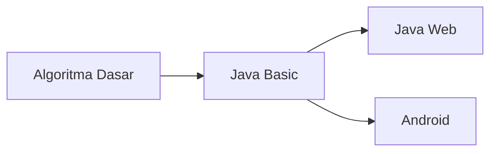

# Belajar Java Mulai Dari Mana?

## Intro

Belakangan di group [Telegram JVM](https://t.me/JVMUserGroup) banyak muncul pertanyaan tentang `Belajar Java Mulai dari Mana?`.  Tulisan ini dibuat supaya ada `guidance`  untuk kawan-kawan semua yang baru mulai belajar Java. 

Secara garis besar, belajarnya bisa mengikuti diagram dibawah ini

