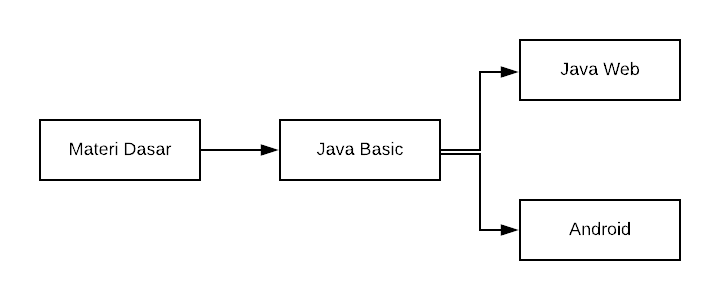

# Belajar Java Mulai Dari Mana?

## Intro

Belakangan di group [Telegram JVM](https://t.me/JVMUserGroup) banyak muncul pertanyaan tentang `Belajar Java Mulai dari Mana?`.  Tulisan ini dibuat supaya ada `guidance`  untuk kawan-kawan semua yang baru mulai belajar Java. 

Ibaratnya main game RPG yang punya `skill tree` berbeda untuk tiap Job yang berbeda. Maka Job sebagai programmer Java juga memiliki skill tree tersendiri. Dan secara garis besar, urutan belajarnya bisa mengikuti diagram dibawah ini

> disclaimer : Your Mileage May Vary

## Materi Dasar

Biasanya gw selalu mulai dengan basic computer science knowledge, hal ini berguna untuk mempersiapkan basic dan pondasi yang kuat sebelum belajar Java. Untuk memulai, berikut rekomendasi beberapa sumber yang berbeda seperti buku, ebook, blog, atau channel youtube yang idealnya dibaca beserta tujuannya.

| Sumber | Tujuan |
| ------ | ------ |
| Donald Knuth - The Art of Computer Programming | Baca basic concept of algorithm di [chapter 1](https://en.wikipedia.org/wiki/The_Art_of_Computer_Programming#Volume_1_%E2%80%93_Fundamental_Algorithms) |
| Konsep dari [Computational Thinking](https://www.youtube.com/watch?v=qbnTZCj0ugI) | Belajar cara memecahkan masalah dengan metode komputasional |
| Sourcecode Management dengan [Git](https://git-scm.com/book/en/v2) | Memahami cara me-manage sourcecode seperti commit, push, resolve conflict, rollback, blame, branching, merging, tagging dan semacamnya |